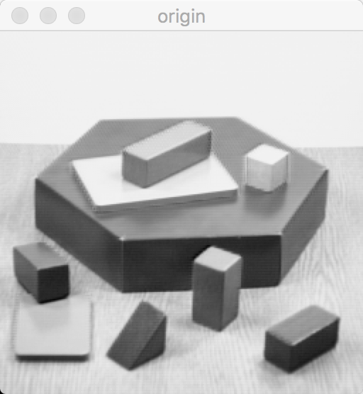
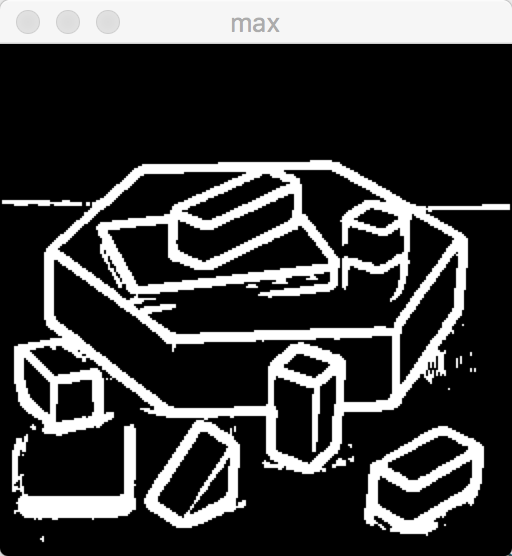
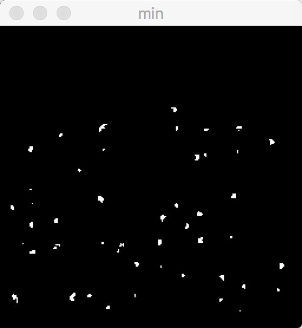
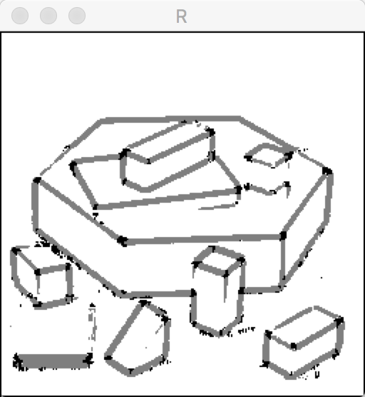
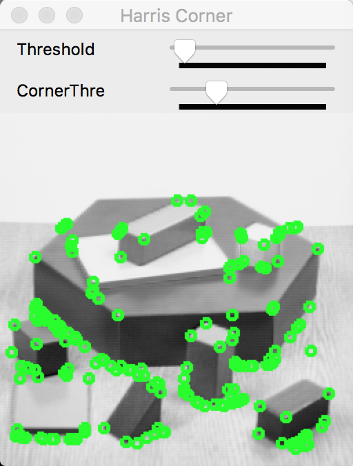
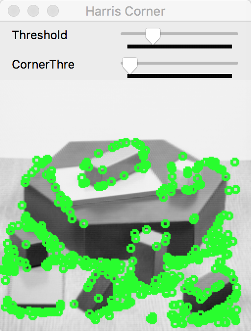
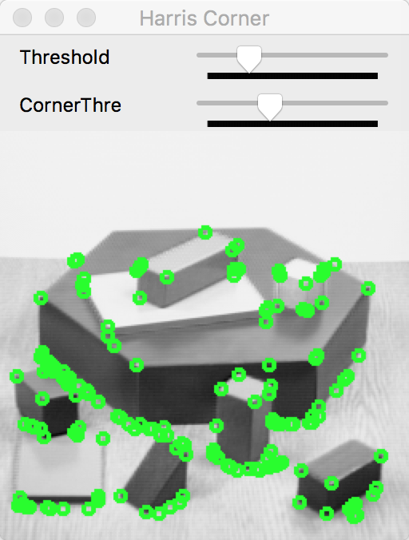

#Lab2 Harris Corner检测算法

##1. 实验内容
* 对输入的一张彩色图像,自己写代码实现Harris Corner检测算法
* 显示中间的处理结果及最终的检测结果,包括最大特征值图,最小 特征值图,R图(可以考虑彩色展示),原图上叠加检测结果等,并将 这些中间结果都输出成图像文件;
* 命令格式: “xxx.exe 图片文件 k参数(=0.04) Aperture_size(=3)”

##2. 算法具体步骤

###A) Sobel算子求导数--RGB彩图转灰度图

* 由于要用Sobel算子对图像求一阶导数，故先将三通道的RGB彩图转成灰度图，使用`cvtColor`函数：第一个参数为源图像(Mat)，第二个图像为目标灰度图像(Mat)。

		cvtColor(src, gray, CV_BGR2GRAY);

* 转成灰度图后对图像用Sobel算子进行求导。Sobel算子的求导原理是用一个3*3的mask对以源像素点为中心的周围九个点进行卷积运算，思想类似于中值微分。卷积mask矩阵如下(M_X, M_Y分别代表对x和y求偏导数的模板)：

	M_X = $$
 \left[
 \begin{matrix}
   1 & 0 & 1 \\
   -2 & 0 & 2 \\
   1 & 0 & 1 
  \end{matrix}
  \right]
$$, 
M_Y = $$
\left[
 \begin{matrix}
   1 & 2 & 1 \\
   0 & 0 & 0 \\
   -1 & -2 & -1 
  \end{matrix}
  \right]
$$

因为对中心像素求导，所以sobel算子对第二行(列)增加了权值2。为方便边界值处理，这里的求导过程用opencv库函数`Sobel`代替。其中前两个参数分别是原图像和目标图像，第三个参数`CV_16S`指定了结果矩阵储存的数据类型(16位有符号整型)，相当于`short`类型。第四和第五个参数表示往哪个坐标轴方向取偏导数，(1, 0)表示偏X，(0, 1)表示偏Y。接下来两个参数为默认值，最后一个参数`BORDER_REPLICATE`表示边界模式，这里采用非默认的`BORDER_REPLICATE`给边界的偏导数赋予了合理的值。经过如下调用后，偏导数值分别存储在矩阵`sobel_x`和`sobel_y`中。

    Sobel(gray, sobel_x, CV_16S, 1, 0, Aperture_size, 1, 0, BORDER_REPLICATE);
    Sobel(gray, sobel_y, CV_16S, 0, 1, Aperture_size, 1, 0, BORDER_REPLICATE);

###B) 核心算法--协方差矩阵的特征值

* Harris Corner检测算法的核心在于如果图像中某个点沿各个方向的偏导数都很大，即各个方向都有较明显的变化梯度。于是我们引入矩阵的特征值来量化这个特性。给定一个偏移向量(u,v)，定义

$$
\begin{equation*}
E(u,v) = \sum_{x, y}w(x, y) * [ I(x+u, y+v) - I(x, y) ] ^ 2
\end{equation*}
$$

对于w(x, y)，我们作简单处理，在3*3窗口内为1，在窗口外为0，含义是每次求E的值时只涉及x，y周围九个点的值。而平方项内作二元函数的泰勒展开，容易得到:

$$
\begin{equation*}
E(u,v) = \sum_{x, y}w(x, y) * [ uI_x(x, y) - vI_y(x, y) ]^2 = [u,v]\sum_{x, y}w(x, y) * \left[
 \begin{matrix}
   I_x^2 & I_xI_y \\
   I_xI_y & I_y^2
  \end{matrix}
\right]\left[
 \begin{matrix}
   u \\
   v
  \end{matrix}
\right]
\end{equation*}
$$

其中矩阵M=$$\sum_{x, y}w(x, y) * \left[
 \begin{matrix}
   I_x^2 & I_xI_y \\
   I_xI_y & I_y^2
  \end{matrix}
\right]
$$
为协方差矩阵，图像中某像素是角点的判断条件是M矩阵拥有两个很大的特征值$$\lambda_1, \lambda_2$$。根据矩阵性质，可得两根之和与两根之积:
	
$$\lambda_1 + \lambda_2 = |M|$$

$$\lambda_1 * \lambda_2 = trace(M)$$

其中trace(M)为M矩阵对角线元素之和。由这个一元二次方程，也可以很容易地用求根公式解出$$\lambda_1, \lambda_2$$的值。

避免求特征值，而用另一种方式判定两个特征值都比较大，即：
	score = det(M) - k * $$trace(M) ^ 2$$

如果score的值比阈值大，则选取为角点。为了使优化效果，加上非极大值抑制，即只有该点score为8连通区域内的极大值点才被选为角点。代码如下：

	void finalCornerImage()
	{
	    vector<Point> points;
	    
	    for (int x = Aperture_size / 2; x <= width - Aperture_size + 1; x++)
	    {
	        for (int y = Aperture_size / 2; y <= height - Aperture_size + 1; y++)
	        {
	            if (score(x, y) > corner_threshold
	                && score(x, y) > score(x-1, y-1) && score(x, y) > score(x-1, y)
	                && score(x, y) > score(x-1, y+1) && score(x, y) > score(x, y-1)
	                && score(x, y) > score(x, y+1) && score(x, y) > score(x+1, y-1)
	                && score(x, y) > score(x+1, y) && score(x, y) > score(x+1, y+1))
	            {
	                points.push_back(Point(x, y));
	            }
	        }
	    }
	    
	    Mat res = src.clone();
	    imshow("origin", src);
	    
	    drawOnImage(res, points);
	    
	    imshow("Harris Corner", res);
	    
	}

而对于中间结果，若最大特征值比阈值大，则为最大特征值图；
	
	void bigEigenImage()
	{
	    Mat my_mat(height, width, CV_8U);
	    
	    for (int x = Aperture_size / 2; x <= width - Aperture_size + 1; x++)
	    {
	        for (int y = Aperture_size / 2; y <= height - Aperture_size + 1; y++)
	        {
	            if (big_eigen(x, y) > my_threshold) {
	                my_mat.at<uchar>(y, x) = 255;
	            }
	            else {
	                my_mat.at<uchar>(y, x) = 0;
	            }
	        }
	    }
	    imshow("max", my_mat);
	}
	
若最小特征值比阈值大，则为最小特征值图。

	void smallEigenImage()
	{
	    Mat my_mat(height, width, CV_8U);
	    
	    for (int x = Aperture_size / 2; x <= width - Aperture_size + 1; x++)
	    {
	        for (int y = Aperture_size / 2; y <= height - Aperture_size + 1; y++)
	        {
	            if (small_eigen(x, y) > my_threshold) {
	                my_mat.at<uchar>(y, x) = 255;
	            }
	            else {
	                my_mat.at<uchar>(y, x) = 0;
	            }
	        }
	    }
	    imshow("min", my_mat);
	}

而对于R图，大于阈值的点为角点，小于0且绝对值大于阈值的点为edge，剩余的为普通点：

	void REigenImage()
	{
	    Mat my_mat(height, width, CV_8U);
	    
	    for (int x = Aperture_size / 2; x <= width - Aperture_size + 1; x++)
	    {
	        for (int y = Aperture_size / 2; y <= height - Aperture_size + 1; y++)
	        {
	            if (score(x, y) > corner_threshold) //corner
	            {
	                my_mat.at<uchar>(y, x) = 0;
	            }
	            else if (score(x, y) < 0 && score(x, y) < -corner_threshold) //edge
	            {
	                my_mat.at<uchar>(y, x) = 127;
	            }
	            else //flat
	            {
	                my_mat.at<uchar>(y, x) = 255;
	            }
	        }
	    }
	    imshow("R", my_mat);
	}

为了便于调节两个阈值，在此设置了两个slide toolbar，方便直接在程序中调节。这个opencv自带的GUI函数如下：

	void on_trackbar(int pos, void *)
	{
	    if (pos > 0) {
	        my_threshold = pos * 1000;
	        bigEigenImage();
	        smallEigenImage();
	        REigenImage();
	        finalCornerImage();
	    }
	}
	
	//工具条
    namedWindow("Harris Corner");
    createTrackbar("Threshold", "Harris Corner", &slider, slider_max, on_trackbar);
    createTrackbar("CornerThre", "Harris Corner", &corn_slider, corner_max, corn_trackbar);

效果如下：

原图：

最大特征图：

最小特征图：

R图:

最后，将被选取为角点的点挑选出来，在原图上的这些点处画绿色的圆高亮显示：

	void drawOnImage(Mat &image, vector<Point> &points)
	{
	    int radius = 3, thickness = 2;
	    
	    // display all corners
	    for (vector<Point>::iterator it = points.begin(); it != points.end(); it++) {
	        circle(image, *it, radius, Scalar(0, 255, 0), thickness);
	    }
	}

结果图：

此刻进度条中的两个阈值分别大约为10000和100000，继续调小第二个阈值（只影响R图和最终结果图），得到结果如下（伪角点明显增多）：

若调小则如下（角点减少）：

所以可以根据工具条调节合适的阈值，使得角点检测效果最佳。

