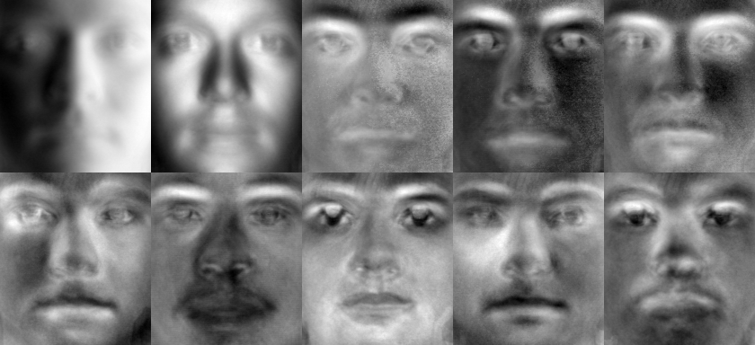

#Lab3 Eigenface人脸检测

##1. 实验内容
自己写代码实现Eigenface人脸识别的训练与识别过程

* 假设每张人脸图像只有一张人脸,且两只眼睛位置已知(即可人工标注给出)。每 张图像的眼睛位置存在相应目录下的一个与图像文件名相同但后缀名为txt的文本文件 里,文本文件中用一行、以空格分隔的4个数字表示,分别对应于两只眼睛中心在图像中的位置;
* 实现两个程序过程(两个执行文件),分别对应训练与识别。
* 训练程序格式大致为: “mytrain.exe 能量百分比 model文件名 其他参数...”,用能 量百分比决定取多少个特征脸,将训练结果输出保存到model文件中 。同时将前10个 特征脸拼成一张图像,然后显示出来。
* 识别程序格式大致为: “mytest.exe 人脸图像文件名 model文件名 其他参数...”,将 model文件装载进来后,对输入的人脸图像进行识别,并将识别结果叠加在输入的人 脸图像上显示出来,同时显示人脸库中跟该人脸图像最相似的图像。

* 本实验用于测试的人脸库为CroppedYale人脸库，实验图片的眼睛已经处理过为统一位置，试验中为了方便测试挑选了其中约487张。

* 实验用Mac OS平台，opencv版本为2.4.9

##2. 算法具体步骤

###A) 算法大体思想--PCA（主元成分分析）

* 特征脸EigenFace的思想是把人脸从像素空间变换到另一个空间，在另一个低维空间中做相似性的计算。EigenFace选择的空间变换方法是PCA。具体实现是对训练集中所有人脸图像的协方差矩阵进行本征值分解，得对对应的本征向量，这些本征向量（特征向量）就是“特征脸”。每个特征向量或者特征脸相当于捕捉或者描述人脸之间的一种变化或者特性，因此每个人脸都可以表示为这些特征脸的线性组合。

###B) 算法的操作流程
	
* 训练过程

	(1) 将训练集的每一个人脸图像都拉长一列，将他们组合在一起形成一个大矩阵A。假设每个人脸图像是MxN大小，那么拉成一列后每个人脸样本的维度就是d=MN大小了。假设有K个人脸图像，那么样本矩阵A的维度就是dK了。

	(2) 将所有的K个人脸在对应维度上加起来，然后求个平均，就得到了一张“平均脸” averageFace。

	(3) 将N个图像都减去那个平均脸图像，得到差值图像的数据矩阵A。

	(4) 计算协方差矩阵S=$$AA^T$$。再对其进行特征值分解。就可以得到想要的特征向量(特征脸)了。
	
	(5) 将步骤(4)中得到的K个特征向量中的前P个最大的特征值对应的向量取出，作为PCA子空间的一组基，通常P取100足够。将训练集中的K张人脸分别投影到这个P维子空间中得到降维后的新坐标$$(X_i^1, X_i^2, ..., X_i^P)$$，i表示第i张人脸。这里的K张人脸对应K个坐标，用作测试比较欧氏距离所用。

* 识别过程

	训练过程保存协方差矩阵的前100个特征向量，然后将测试图片读入预处理后，也在这个降维后的P维PCA子空间中找到对应的坐标$$(X_1, X_2, ..., X_P)$$。这里用这个坐标与训练过程得到的K个坐标分别求欧氏距离，即可比对出与测试图片欧氏距离最小的一张人脸，此时完成识别过程。

###C) 算法实现要点

* 首先根据目录文件读取其中的部分图片作为人脸库测试训练用图，这里测试使用487张人脸库图片+1张金城武照片+ 1张自己的照片。这里先选取以"+00.pgm"结尾的所有人脸库的图片，再最后加上自己加入的两张图片。由程序中的`getFileList`函数实现。

* 首先要做图片的预处理，对灰度值作归一化，这里使用直方图均衡化的方法，先转灰度图再直方图均衡化，函数如下（返回eql就是均衡化后的Mat图像）：
		
		//输入Mat，返回Mat
		Mat histEqualize(Mat src)
		{
		    Mat gray, eql;
		    cvtColor(src, gray, CV_BGR2GRAY);
		    equalizeHist(gray, eql);
		    return eql;
		}

* 预处理过后进入正式的算法流程，首先将每张M*N的人脸拉成一个( MN * 1) 列向量，对这K个向量求出的平均向量，即样本的平均脸 $$\mu$$:

$$
\begin{equation*}
\mu = \frac{1}{n}\sum_{n=1}^n x_i
\end{equation*}
$$

* 样本中每张人脸减去平均脸后，计算协方差矩阵S：

$$A=[A_1, A_2, ..., A_K],  A_i$$表示一张人脸,是MN列维向量，M，N为图片长和宽

$$A_i = X_i - \mu$$

$$S=AA^T$$

此时我们发现协方差矩阵S的维数已经达到MN*MN，通常一张图片的长宽为上百像素，所以矩阵S的行列均超过10000，即S为10000 * 10000维的大矩阵。对这样一个维数大的矩阵求特征值(O($$N^3$$)时间复杂度)会带来巨大无比的计算量。而我们其实可以通过一个转化将维数降低，通过求$$A^TA$$而得到相同的特征值和一一对应的特征向量，这个对应关系推导如下：

$$AA^T$$的特征向量和特征值关系：$$AA^T X=\lambda X$$

两边同时左乘矩阵$$A^T$$，得到：$$A^TAA^T X=\lambda A^TX  -> A^TA(A^TX)=\lambda (A^TX)$$

这里我们可以清楚看到矩阵$$AA^T$$的特征值与$$A^TA$$完全一样，而特征向量只需左乘一个$$A^T$$即可，而$$A^TA$$的维数只有K*K（通常样本数K远小于图片像素点个数MN），所以通过这个小转化可以减少计算量，即我们先将K * K的小矩阵$$A^TA$$的特征向量求出，然后每个向量左乘$$A^T$$即可得到真正的协方差矩阵S的全部特征向量。

	Mat eigenvalues(K, 1, CV_64FC1), eigenvectors(K, K, CV_64FC1);
    
    //X_matrix即上述矩阵A，这里求小矩阵A.t()*A的特征向量
    eigen(X_matrix.t() * X_matrix, eigenvalues, eigenvectors);
    
    //转置，按列排列特征向量
    eigenvectors = eigenvectors.t();
    
    //真正的协方差矩阵特征向量
    Mat real_eig_vectors(M * N, PREV, CV_64FC1);
    
    for (int i = 0; i < PREV; i++) {
        real_eig_vectors.col(i) = X_matrix * eigenvectors.col(i);
        //向量模长处理为1，即除以向量的二范数norm_L2
        real_eig_vectors.col(i) /= norm(real_eig_vectors.col(i), NORM_L2);
    }

* 上面我们得到了协方差矩阵的所有特征向量，我们进行PCA的降维操作：将前100大特征值对应的特征脸保存在文件中（FileStorage类），然后将前十大特征值对应的特征脸显示出来。因为这里的特征向量全部经过归一化处理，所以我们只需要做一次normalize操作，将像素值映射回0-255单通道灰度图即可显示。我们这里开一个大矩阵，在一个大窗口中以2行5列的样式显示10张特征脸。

		//2*5 * M*N
	    Mat total_eigenface(2 * M, 5 * N, CV_8UC1);
	    
	    
	    std::vector<Mat> eigenfaces;
	    
	    for (int t = 0; t < PREV; t++) {
	        
	        Mat tmpface(M, N, CV_64FC1);
	        
	        //一维图像向量转二维图片
	        for (int i = 0; i < M; i++) {
	            for (int j = 0; j < N; j++) {
	                tmpface.at<double>(i, j) = real_eig_vectors.at<double>(i * N + j, t);
	            }
	        }
	        
	        Mat dst;
	        Mat eigenface;
	        
	        //映射到0-255，映射方式为NORM_MINMAX，即给定最小值最大值的映射
	        normalize(tmpface, dst, 0, 255, NORM_MINMAX);
	        
	        //将浮点型Mat进行类型转换，用于显示图像
	        dst.convertTo(eigenface, CV_8UC1);
	        
	        //save
	        eigenfaces.push_back(tmpface);
	        
	        char str[15];
	        sprintf(str, "eface%dth", t);
	
	        fs << str << tmpface;
	        
	        //merge to one window
	        //只有前十张需要显示
	        if (t >= 10) {
	            continue;
	        }
	        
	        int startX = t / 5 * M, startY = (t % 5) * N;
	        
	        for (int i = 0; i < M; i++) {
	            for (int j = 0; j < N; j++) {
	                total_eigenface.at<uchar>(startX + i, startY + j) = eigenface.at<uchar>(i, j);
	            }
	        }
	
	    }
	    
	    //ten eigenfaces shown in one big window
	    imshow("Eigenfaces", total_eigenface);

这里我们运行效果如下

前十个特征向量（特征脸）就显示完成了。

* 训练过程的最后一步就是在上面的PCA子空间中完成投影，即将原样本图像的100个方向的分量保留，其余的去除。我们将原图像MN维向量投影到P=100维子空间后，为了得到该向量在100维PCA子空间的坐标，我们需要将向量在这个子空间的100个特征向量方向上根据平行四边形法则进行分解。而这个协方差矩阵的特殊性质可以方便我们完成这一操作：因为协方差矩阵$$S=AA^T$$是实对称矩阵，其不同特征值对应的特征向量必然两两正交，所以在这组基下找向量的坐标变得非常容易：只需要将原向量和每一个单位基向量作内积即可得到原向量在这个基向量方向上的分量(即坐标值)。

		//计算样本K张图片在新坐标系下的坐标（PREV=100）
	    Mat coordinate(PREV, K, CV_64FC1);
	    for (int i = 0; i < K; i++) {
	    	//相当于原图减均值后与real_eig_vectors里面的前100个特征向量分别作内积
	        coordinate.col(i) = real_eig_vectors.t() * (X_matrix.col(i) - average);
	    }

内积操作完成后，coordinate矩阵的第i列表示的就是第i张图在新的PCA子空间下的新坐标，这个坐标是100维坐，K张图就得到了K个这样的100维坐标。

* 识别过程的思路就是对目标图像减去平均值作相同的投影操作，投影到上面的P=100维子空间中，找到目标图像的坐标值，于是我们就可以将该点坐标与训练得到的K张图的坐标作欧氏距离，可以找出最接近的一张脸。当然识别前要先将训练得到的特征向量、平均脸等信息先读进内存。

		//测试部分
	    Mat gray = imread("CroppedYale/myfolder/king.png");
	    
	    //show
	    imshow("gray", gray);
	    
	    //测试图片转灰度图
	    Mat qry;
	    cvtColor(gray, qry, CV_BGR2GRAY);
	    
	    //二维转一维
	    Mat line_qry(M * N, 1, CV_64FC1);
	    for (int i = 0; i < M; i++) {
	        for (int j = 0; j < N; j++) {
	            line_qry.at<double>(i * N + j, 0) = qry.at<uchar>(i, j);
	        }
	    }
	    
	    
	    //找出欧式距离最小的点，欧氏距离可以用向量的二范数来求
	    int min_id = 0;
	
	    double min = norm(query - coordinate.col(0), NORM_L2);
	    
	    for (int i = 1; i < K; i++) {
	        double form = norm(query - coordinate.col(i), NORM_L2);
	        
	        if (form < min) {
	            min = form;
	            min_id = i;
	        }
	    }
	    
	    //输出最接近图片的id值
	    cout << min_id << endl;
	    
	    //显示最接近的图片
	    imshow("dst", src[min_id]);

投影到子空间的代码如下：

	//100*mn mn*1
    Mat query(PREV, 1, CV_64FC1);
    
    query = eigenvectors.t() * (line_qry - average);
    
    Mat submat = Mat::zeros(M, N, CV_64FC1);
    for (int t = 0; t < PREV; t++) {
        double weight = query.at<double>(t, 0);
        submat += weight * eigenfaces[t];
    }
    
	//类型转换用于显示
    submat.convertTo(submat, CV_8UC1);
    
    imwrite("submat.png", submat);

