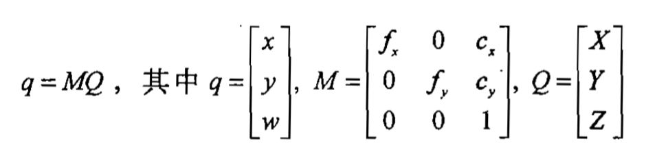
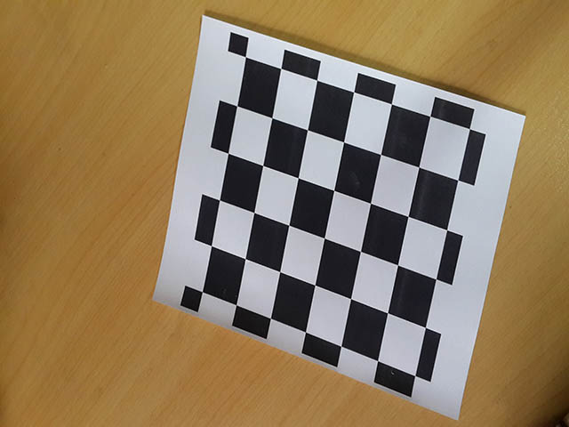

#Lab4 Calibration and Bird-eye

学号：3130100677 姓名：黄卓斐

##1. 实验内容
自己写代码实现Eigenface人脸识别的训练与识别过程

* Camera calibration 摄相机标定
* Bird’s‐eye view transformation 鸟瞰视图变换
* 将两个程序合二为一
* 实验用Mac OS平台，opencv版本为2.4.9

##2. 算法具体原理和步骤

###A) 基本投影几何

将坐标为$$(X_i, Y_i, Z_i)$$的物理点$$Q_i$$映射到投影平面为$$(x_i, y_i)$$的点的过程为投影变换。其次坐标将维数为n的点用n+1维的向量来表示，额外的限制是任意两点的交比不变。图像平面是一个二维投影空间，因此可以用一个三维向量$$q=(q_1, q_2, q_3)$$来表示一个点，通过每个分量除以$$q_3$$，计算实际的像素坐标值。这样我们将定义摄像机的参数$$ (f_x, f_y, c_x, c_y)$$重新排列成一个3×3的矩阵，该矩阵成为摄像机的内参矩阵。

这里(X, Y, Z)是一个点的世界坐标，(x, y)是点投影在图像平面的坐标，以像素为单位。M被称作摄像机矩阵，或者内参数矩阵。$$(c_x, c_y)$$是基准点（通常在图像的中心），fx, fy是以像素为单位的焦距。所以如果因为某些因素对来自于摄像机的一幅图像升采样或者降采样，所有这些参数(fx, fy, cx和cy)都将被缩放（乘或者除）同样的尺度。内参数矩阵不依赖场景的视图，一旦计算出，可以被重复使用（只要焦距固定）。旋转－平移矩阵[R|t]被称作外参数矩阵，它用来描述相机相对于一个固定场景的运动，或者相反，物体围绕相机的的刚性运动。也就是[R|t]将点(X, Y, Z)的坐标变换到某个坐标系，这个坐标系相对于摄像机来说是固定不变的。

###B) 镜头畸变

一般来说，镜头畸变实际上是光学透镜固有的透视失真的总称，也就是因为透视原因造成的失真，这种失真对于照片的成像质量是非常不利的，毕竟摄影的目的是为了再现，而非夸张，但因为这是透镜的固有特性（凸透镜汇聚光线、凹透镜发散光线），所以无法消除，只能改善。高档镜头光学设计以及用料考究，利用镜片组的优化设计、选用高质量的光学玻璃（如萤石玻璃）来制造镜片，可以使透视变形降到很低的程度。但是完全消除畸变是不可能的，目前最高质量的镜头在极其严格的条件下测试，在镜头的边缘也会产生不同程度的变形和失真。

* 径向畸变:

	平面上任何一点P，可以用直角坐标(x,y)表示， 也可以用极坐标P($$\rho,\theta$$)表示，或简写为(r, t), 极坐标表示也就是矢量表示，其中r是矢量长度，t是矢量的水平夹角， 相机成像后其图像也可以用上述2种坐标来表示：P'(x',y'),P'(r',t'). 而相机成像后其图像所产生的畸变也可以用上述2种坐标来表示： 用直角坐标法表示：dx = x'- x, dy = y'- y 用矢量表示法表示：dr = r'- r, dt = t'- t “径向畸变”就是矢量端点沿长度方向发生的变化dr,也就是矢径的变化, “切向畸变”就是矢量端点沿切线方向发生的变化,也就是角度的变化dt。

###C) 摄像机标定

利用摄像机所拍摄到的图像来还原空间中的物体。在这里，不妨假设摄像机所拍摄到的图像与三维空间中的物体之间存在以下一种简单的线性关系：像=M*物,这里，矩阵M可以看成是摄像机成像的几何模型。 M中的参数就是摄像机参数。通常，这些参数是要通过实验与计算来得到的。这个求解参数的过程就称为摄像机标定。

摄像机标定原理：

在这里假定模板平面在世界坐标系Z=0的平面上。

其中，K为摄像机的内参数矩阵，$$[X, Y, 1]^T$$为模板平面上点的齐次坐标，$$[u, v, 1]^T$$为模板平面上点投影到图象平面上对应点的齐次坐标，$$[r_1, r_2, r_3]$$和 $$t$$ 分别是摄像机坐标系相对于世界坐标系的旋转矩阵和平移向量。

根据旋转矩阵的性质，即 $$r_1^Tr_2=0$$ 和$$||r1||=||r2||=1$$，每幅图象可以获得以下两个对内参数矩阵的基本约束

由于摄像机有4个未知内参数，所以当所摄取得的图像数目大于等于3时，就可以线性唯一求解出K。

算法描述：

* 打印一张模板并贴在一个平面上；
* 从不同角度拍摄若干张模板图像；
* 检测出图像中的特征点；
* 求出摄像机的内参数和外参数；
* 求出畸变系数。

将摄像机参数计算完后保存，在下一步俯瞰变换中会使用。

###D) 俯瞰变换

鸟瞰图：根据透视原理，用高视点透视法从高处某一点俯视地面起伏绘制成的立体图。

##3. 算法实现要点

###A) 棋盘图片的摄像机标定

* 当前文件夹下预备n张图片，根据图片名称`right01.jpg`等进行载入图片，这里用`sprintf`函数实现数字转字符串。

		char filename[20];
	    int i = 1;
	    sprintf(filename, "right%02d.jpg", i);
	    
	    IplImage *image = cvLoadImage(filename);
	    IplImage *gray_image = cvCreateImage(cvGetSize(image),8,1);//subpixel

* while循环读取图片，调用`cvFindChessboardCorners`函数检测棋盘内角点数，标出符合条件的图片。

		while(successes < n_boards) {
		        //Skip every board_dt frames to allow user to move chessboard
		        //Find chessboard corners:
		        
		        int found = cvFindChessboardCorners(
		                                            image, board_sz, corners, &corner_count,
		                                            CV_CALIB_CB_ADAPTIVE_THRESH | CV_CALIB_CB_FILTER_QUADS
		                                            );
		        
		        //Get Subpixel accuracy on those corners
		        cvCvtColor(image, gray_image, CV_BGR2GRAY);
		        cvFindCornerSubPix(gray_image, corners, corner_count,
		                           cvSize(11,11),cvSize(-1,-1), cvTermCriteria(
		                                                                       CV_TERMCRIT_EPS+CV_TERMCRIT_ITER, 30, 0.1 ));
		        
		        //Draw it
		        cvDrawChessboardCorners(image, board_sz, corners,
		                                corner_count, found);
		        //      cvShowImage( "Calibration", image );
		        
		        // If we got a good board, add it to our data
		        if( corner_count == board_n ) {
		            cvShowImage( "Calibration", image ); //show in color if we did collect the image
		            step = successes*board_n;
		            for( int i=step, j=0; j<board_n; ++i,++j ) {
		            	//逐个像素赋值
		                CV_MAT_ELEM(*image_points, float,i,0) = corners[j].x;
		                CV_MAT_ELEM(*image_points, float,i,1) = corners[j].y;
		                CV_MAT_ELEM(*object_points,float,i,0) = j/board_w;
		                CV_MAT_ELEM(*object_points,float,i,1) = j%board_w;
		                CV_MAT_ELEM(*object_points,float,i,2) = 0.0f;
		            }
		            CV_MAT_ELEM(*point_counts, int,successes,0) = board_n;
		            successes++;
		            printf("Collected our %d of %d needed chessboard images\n",successes,n_boards);
		        }
		        else
		            cvShowImage( "Calibration", gray_image ); //Show Gray if we didn't collect the image
		        //end skip board_dt between chessboard capture
		        
		        
		        i++;
		        
		        if (i > n_boards) {
		            break;
		        }
		        
		        //获取下一个文件，按文件名字典序升序
		        sprintf(filename, "right%02d.jpg", i);
		        image = cvLoadImage(filename);
		        
		    }

* 根据检测出的棋盘数`successes`来创建矩阵，重点是获取内参矩阵`intrinsic_matrix`。

	    CvMat* object_points2  = cvCreateMat(successes*board_n,3,CV_32FC1);
	    CvMat* image_points2   = cvCreateMat(successes*board_n,2,CV_32FC1);
	    CvMat* point_counts2   = cvCreateMat(successes,1,CV_32SC1);
	    
	    //TRANSFER THE POINTS INTO THE CORRECT SIZE MATRICES
	    for(int i = 0; i<successes*board_n; ++i){
	        CV_MAT_ELEM( *image_points2, float, i, 0) = CV_MAT_ELEM( *image_points, float, i, 0);
	        CV_MAT_ELEM( *image_points2, float,i,1) = CV_MAT_ELEM( *image_points, float, i, 1);
	        CV_MAT_ELEM(*object_points2, float, i, 0) = CV_MAT_ELEM( *object_points, float, i, 0) ;
	        CV_MAT_ELEM( *object_points2, float, i, 1) = CV_MAT_ELEM( *object_points, float, i, 1) ;
	        CV_MAT_ELEM( *object_points2, float, i, 2) = CV_MAT_ELEM( *object_points, float, i, 2) ;
	    }
	    
	    for(int i=0; i<successes; ++i) { //These are all the same number
	        CV_MAT_ELEM( *point_counts2, int, i, 0) =
	        CV_MAT_ELEM( *point_counts, int, i, 0);
	    }
	    cvReleaseMat(&object_points);
	    cvReleaseMat(&image_points);
	    cvReleaseMat(&point_counts);
	    
	    CV_MAT_ELEM( *intrinsic_matrix, float, 0, 0 ) = 1.0f;
	    CV_MAT_ELEM( *intrinsic_matrix, float, 1, 1 ) = 1.0f;

* 调用摄像机标定函数`cvCalibrateCamera2`

		cvCalibrateCamera2(
                       object_points2, image_points2,
                       point_counts2,  cvGetSize( image ),
                       intrinsic_matrix, distortion_coeffs,
                       NULL, NULL,0 
                       );

至此，我们获得了相机内参数矩阵`intrinsic_matrix`和校正矩阵`distortion_coeffs`，用作下面俯瞰视图变换的参数。

###B) 俯瞰视图变换

* 矫正图像

		cvInitUndistortMap(intrisic,distortion,mapx,mapy);
		IplImage * t=cvCloneImage(image);//分配了新的存储空间
		cvRemap(t,image,mapx,mapy);

* 得到棋盘上的角点

		int found = cvFindChessboardCorners(
                image,
                board_sz,
                corners,
                &corner_count,
                CV_CALIB_CB_ADAPTIVE_THRESH | CV_CALIB_CB_FILTER_QUADS
                );
       	if(!found) {
        	printf("Couldn't aquire checkerboard on %s, only found %d of %d corners\n",
               file_name, corner_count, board_n);
        	return 1;
    	}
    	cvFindCornerSubPix(gray_image, corners, corner_count,
                       cvSize(11,11),cvSize(-1,-1),
                       cvTermCriteria( CV_TERMCRIT_EPS+CV_TERMCRIT_ITER, 30, 0.1 ));
	      CvPoint2D32f objPts[4], imgPts[4];
	    objPts[0].x = 0;         objPts[0].y = 0;
	    objPts[1].x = board_w-1; objPts[1].y = 0;
	    objPts[2].x = 0;         objPts[2].y = board_h-1;
	    objPts[3].x = board_w-1; objPts[3].y = board_h-1;
	    imgPts[0] = corners[0];
	    imgPts[1] = corners[board_w-1];
	    imgPts[2] = corners[(board_h-1)*board_w];
	    imgPts[3] = corners[(board_h-1)*board_w + board_w-1];
    

* 画图

		cvCircle(image,cvPointFrom32f(imgPts[0]),9,CV_RGB(0,0,255),3);
	    cvCircle(image,cvPointFrom32f(imgPts[1]),9,CV_RGB(0,255,0),3);
	    cvCircle(image,cvPointFrom32f(imgPts[2]),9,CV_RGB(255,0,0),3);
	    cvCircle(image,cvPointFrom32f(imgPts[3]),9,CV_RGB(255,255,0),3);
	    
	    //DRAW THE FOUND CHECKERBOARD
	    cvDrawChessboardCorners(image, board_sz, corners, corner_count, found);
	    cvShowImage( "Checker Chessboard", image );
	    
* 求解单应矩阵H

		//FIND THE HOMOGRAPHY
	    CvMat *H = cvCreateMat( 3, 3, CV_32F);
	    cvGetPerspectiveTransform(objPts,imgPts,H);
	    
* 用户keyboard调节图片显示大小

		float Z = 25;
	    int key = 0;
	    IplImage *birds_image = cvCloneImage(image);
	    cvNamedWindow("Birds_Eye");
	    while(key != 27) {//escape key stops
	        CV_MAT_ELEM(*H,float,2,2) = Z;
	        
	        cvWarpPerspective(image,birds_image,H,
	                CV_INTER_LINEAR+CV_WARP_INVERSE_MAP+CV_WARP_FILL_OUTLIERS );
	        cvShowImage("Birds_Eye", birds_image);
	        key = cvWaitKey();
	        if(key == 'u') Z += 0.5;
	        if(key == 'd') Z -= 0.5;
	    }

##4. 实验结果展示及分析

实验使用了14张样例图片用于标定，在目录下以`right0i.jpg`等命名：

....

标定过程中筛选符合条件的successes张图片，结果如下:

14张测试图片全部被选中。

对于测试图片`test.jpg`，根据标定参数得到的绘制棋盘的结果如下：

鸟瞰视图如下：

按下键盘u键或d键进行缩放，得到

